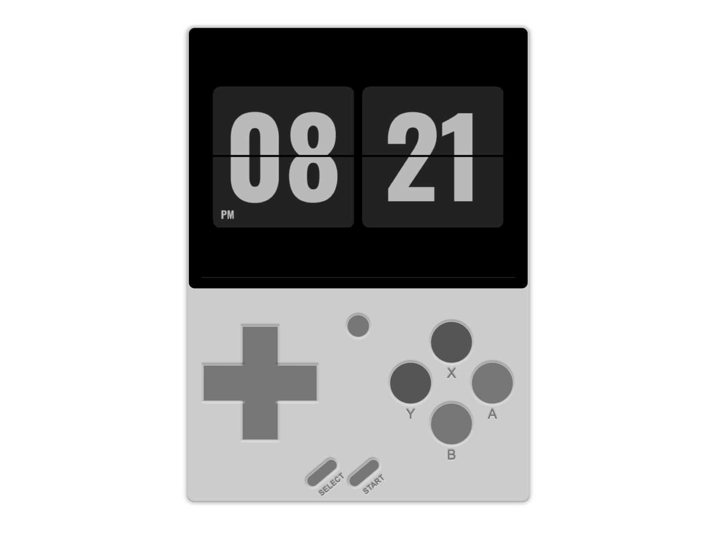

<h1 align="center">SDL Flip Clock for the Miyoo Mini</h1>

<label>

<small><i>Preview!</i></small>
</label>

This is a simple Flip Clock created using SDL.

## Features

- Always awake
- Quit the program using <kbd>Menu</kbd> + <kbd>Select</kbd>
- And ... that's it all!

## Download

[Click here to get the last version released](https://github.com/JaeSeoKim/sdl-flip-clock/releases)

## Installation

### To use with Onion-OS

1. Download and unzip the latest release file
2. Move the unzipped folder to the `/App` path on the SD card
> [!IMPORTANT]  
> The directory name must be `FlipClock`!
3. Boot up your Miyoomini and run `Flip Clock` in the Apps section!
